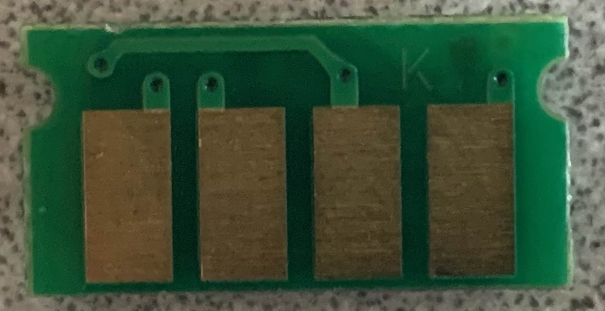
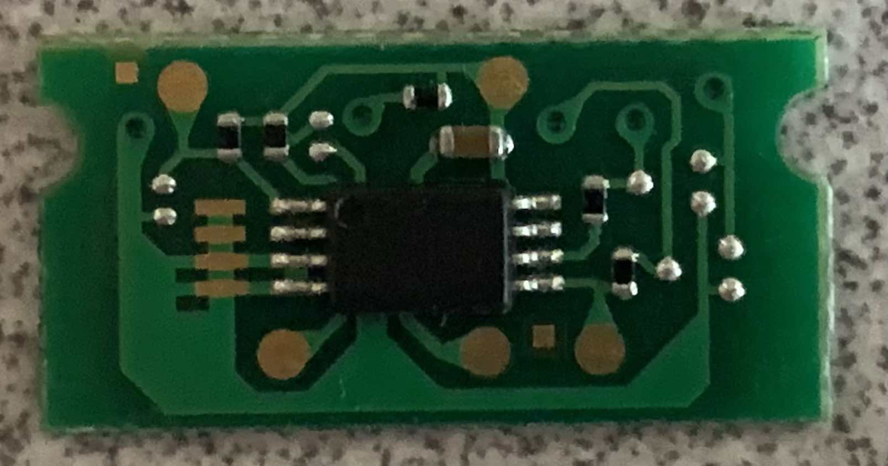
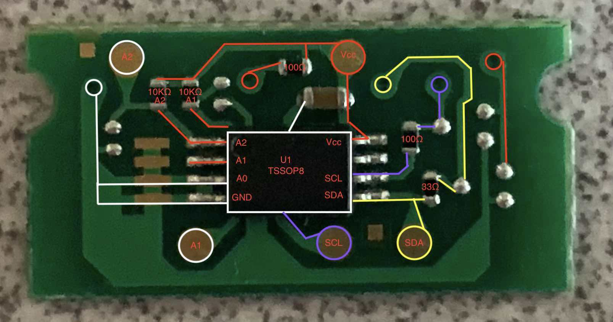
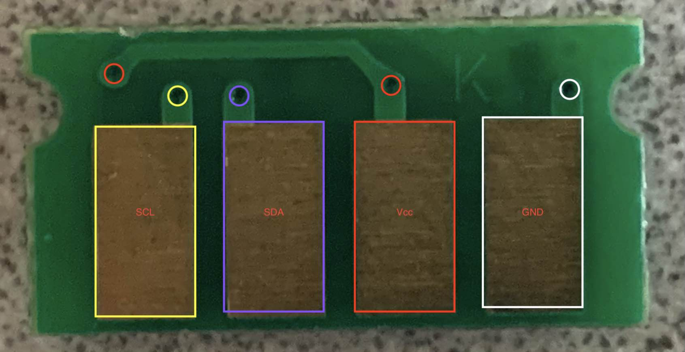
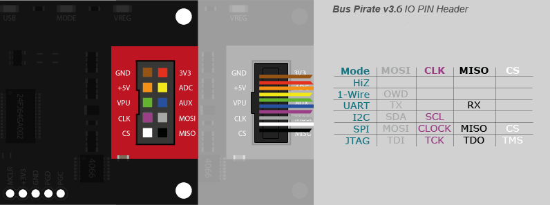

# Ricoh Type 145 Toner Chip Investigations
I currently own a Ricoh C420DN Color Laser printer which uses Type 145 toner.  As new toner can be quite expensive, I've been turing to the used overstock markets to buy toner.  Along the way I've been able to purchase new old stock toner, as well as used toner.

I've noticed that some of the previous used toner, when placed into the printer, doesn't reset the supply level.  Searching the internet for information regarding how the supply level works led me to the chip embedded into the toner cartridge itself.  

Since I had an empty cartridge lying around, I pulled the chip off to examine it:
The interface:

The face:


# Pin Identification

TSSOP8 looks like an EEPROM with I2C interface.  Signal identification was fairly easy - as two pads on the interface side go directly to IC through resistors.  The other two pads must be Vcc/Ground.  Ground was identified by the larger copper traces, along with direct connection to the IC.  Which leaves Vcc, which is connected to Vcc with a capacitor, and a couple of address lines via 10K resistors.  

The address line settings aligns with black toner cartridge I2C address space. SCL/SDA are passed with vias to the connector side of the board.  


# Interfacing 
A helpful tool for interfacing with unknown busses is the [Bus Pirate](http://dangerousprototypes.com/docs/Bus_Pirate) 

I used it for this investigation.  Using a v3b version. 

# Bus Pirate Interface

Using the above map
| Bus Pirate Pin | Destination |
| :--------------: | ----------- |
| GND            | GND on Toner board |
| 3V3            | Vcc on Toner board |
| VPU            | 3V3 on Bus Pirate |
| MOSI           | SDA on Toner board |
| CLK            | SCL on Toner board |

# Bus Pirate Configuration
<ol>
<li>Connect to toner board - jumpers and tape work well here</li>
<li>Switch to I2C mode

```
HiZ>m
1. HiZ
2. 1-WIRE
3. UART
4. I2C
5. SPI
6. 2WIRE
7. 3WIRE
8. LCD
9. DIO
x. exit(without change)

(1)>4
```
</li>
<li>400KHz speed

```
Set speed:
 1. ~5KHz
 2. ~50KHz
 3. ~100KHz
 4. ~400KHz

(1)>4
Ready
```
</li>
<li>Switch power supply on

```I2C>W
Power supplies ON
```
</li>
<li>Validate VPU@3.3V

```
I2C>v
Pinstates:
1.(BR)  2.(RD)  3.(OR)  4.(YW)  5.(GN)  6.(BL)  7.(PU)  8.(GR)  9.(WT)  0.(Blk)
GND     3.3V    5.0V    ADC     VPU     AUX     SCL     SDA     -       -
P       P       P       I       I       I       I       I       I       I
GND     3.28V   4.97V   0.00V   3.28V   L       L       L       L       L
```
</li>
<li>Set pullup resistors to on

```
I2C>P
Pull-up resistors ON
```
</li>
<li>Search for I2C devices

```
I2C>(1)
Searching I2C address space. Found devices at:
0xA6(0x53 W) 0xA7(0x53 R)
```
</li>
</ol>

# Reading Toner EEPROM
Once the toner board is connected to the Bus Pirate, use a read command to read the EEPROM.  I found that for the Type 145 boards that I have, reading past 128 bytes repeats data.
```
I2C>[0xa6 0x00 [0xa7 r:128]
I2C START BIT
WRITE: 0xA6 ACK
WRITE: 0x00 ACK
I2C START BIT
WRITE: 0xA7 ACK
READ: 0xA2  ACK 0x00  ACK 0x01  ACK 0x02  ACK 0x0F  ACK 0x01  ACK 0x01  ACK 0xFF  ACK 0x00  ACK 0x00  ACK 0xFF  ACK 0xFF  ACK 0xFF  ACK 0xFF  ACK 0xFF  ACK 0xFF  ACK 0x32  ACK 0x30  ACK 0x31  ACK 0x33  ACK 0x30  ACK 0x34  ACK 0x4B  ACK 0x4A  ACK 0x43  ACK 0x37  ACK 0x30  ACK 0x30  ACK 0x33  ACK 0x36  ACK 0x38  ACK 0x32  ACK 0x38  ACK 0x38  ACK 0x38  ACK 0x33  ACK 0x30  ACK 0x38  ACK 0x00  ACK 0x00  ACK 0x0E  ACK 0x00  ACK 0x00  ACK 0x00  ACK 0xFF  ACK 0xFF  ACK 0xFF  ACK 0xFF  ACK 0x00  ACK 0x00  ACK 0x87  ACK 0xA5  ACK 0x00  ACK 0x02  ACK 0xE3  ACK 0x4A  ACK 0xFF  ACK 0xFF  ACK 0xFF  ACK 0xFF  ACK 0xFF  ACK 0xFF  ACK 0xFF  ACK 0xFF  ACK 0x00  ACK 0xFF  ACK 0xFF  ACK 0xFF  ACK 0xFF  ACK 0xFF  ACK 0xFF  ACK 0xFF  ACK 0xFF  ACK 0xFF  ACK 0xFF  ACK 0xFF  ACK 0xFF  ACK 0xFF  ACK 0xFF  ACK 0xFF  ACK 0xFF  ACK 0xFF  ACK 0xFF  ACK 0xFF  ACK 0xFF  ACK 0xFF  ACK 0xFF  ACK 0xFF  ACK 0x20  ACK 0x06  ACK 0x01  ACK 0x22  ACK 0xFF  ACK 0xFF  ACK 0xFF  ACK 0xFF  ACK 0xFF  ACK 0xFF  ACK 0xFF  ACK 0xFF  ACK 0xFF  ACK 0xFF  ACK 0xFF  ACK 0xFF  ACK 0xFF  ACK 0xFF  ACK 0xFF  ACK 0xFF  ACK 0xFF  ACK 0xFF  ACK 0xFF  ACK 0xFF  ACK 0x43  ACK 0x48  ACK 0x49  ACK 0x50  ACK 0xFF  ACK 0xFF  ACK 0xFF  ACK 0xFF  ACK 0xFF  ACK 0xFF  ACK 0xFF  ACK 0xFF  ACK 0xFF  ACK 0xFF  ACK 0xFF  ACK 0xFF
NACK
I2C STOP BIT
I2C>
```

You can then cut/paste the READ output into a text file, and then convert to binary using:
```
sed -i -e "s/  ACK//g" output.txt ; cat blah.txt | xargs printf "%02x\n" | xxd -c 1 -p -r > output.bin
```
Then display the binary in Hex/ASCII:
```
xxd blah.bin
00000000: a200 0102 0f01 01ff 0000 ffff ffff ffff  ................
00000010: 3230 3133 3034 4b4a 4337 3030 3336 3832  201304KJC7003682
00000020: 3838 3833 3038 0000 0e00 0000 ffff ffff  888308..........
00000030: 0000 87a5 0002 e34a ffff ffff ffff ffff  .......J........
00000040: 00ff ffff ffff ffff ffff ffff ffff ffff  ................
00000050: ffff ffff ffff ffff 2006 0122 ffff ffff  ........ .."....
00000060: ffff ffff ffff ffff ffff ffff ffff ffff  ................
00000070: 4348 4950 ffff ffff ffff ffff ffff ffff  CHIP............
```

Or you can use [i2c-dump](https://github.com/AdamLaurie/i2c-dump/tree/master) to dump the EEPROM to a binary file. 

# Links
* [i2c-dump](https://github.com/AdamLaurie/i2c-dump/tree/master)
* [Toner Chip Reset](https://github.com/lugu/toner_chip_reset)
